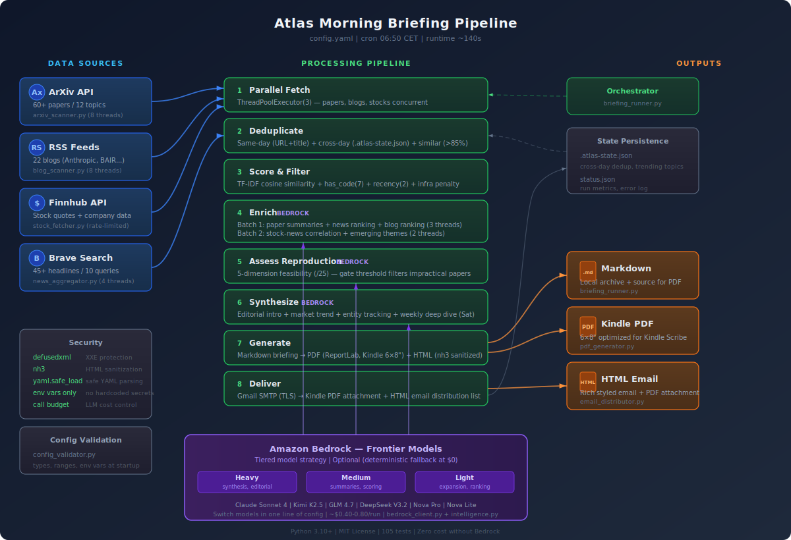

# Atlas Morning Briefing

> **IMPORTANT NOTICE: This project is NOT production-ready. It is provided strictly for testing, experimentation, and educational purposes only. This code has NOT undergone AWS security review and is NOT intended for deployment in production environments or for use with real end-users. Use at your own risk. No guarantees are made regarding security, reliability, availability, or fitness for any particular purpose.**

A fully automated morning briefing pipeline that scans ArXiv papers, RSS blogs, stock tickers, and news headlines — then uses Amazon Bedrock to synthesize everything into a Kindle-optimized PDF delivered to your inbox before you wake up.

Supports **Claude Sonnet 4, Kimi K2.5, GLM 4.7, DeepSeek V3.2, Nova Pro, and Nova Lite** on Amazon Bedrock. Switch models in one line of config. Runs without AWS credentials in deterministic mode at zero cost.

## What It Does

```
6:50 AM  ┌─ ArXiv API ──────── 60+ papers across 12 topic areas
         ├─ RSS Feeds ──────── 22 blogs (Anthropic, Karpathy, BAIR, DeepMind...)
         ├─ Finnhub API ────── Stock watchlist with OHLC data
         └─ Brave Search ───── 45+ news headlines from 10 queries
              │
              ▼
         ┌─ Parallel fetch (3 threads) + deduplication
         ├─ TF-IDF + LLM semantic scoring for paper relevance
         ├─ Reproduction feasibility gate (5-dimension, scored /25)
         ├─ Stock-news correlation (links price moves to headlines)
         ├─ Cross-source theme detection (papers × blogs × news)
         ├─ Editorial synthesis with today's key takeaway
         └─ Weekly deep dive (generated every Saturday)
              │
              ▼
         Kindle PDF (6×8") → Gmail SMTP → Kindle + email list
```

### Pipeline Steps

1. **Fetch** — ArXiv papers, RSS blogs, and stock quotes are fetched in parallel (3 threads). News queries run after optional dynamic query generation from the intelligence layer.
2. **Deduplicate** — Same-day news/blog overlap removed by URL domain and title. Similar papers collapsed at >85% title similarity (SequenceMatcher). Cross-day dedup skips items from yesterday's briefing via `.atlas-state.json`.
3. **Filter & Score** — Papers scored by a weighted formula: `has_code×7 + topic_match×3 + recency×2 + citation×1`, with infrastructure penalties for datacenter-scale or theory-only work. LLM semantic scoring optionally supplements TF-IDF.
4. **Enrich** — Three parallel LLM calls: paper summarization + semantic scoring, news ranking, blog ranking. Then two more: stock-news correlation, emerging theme detection.
5. **Assess** — Top papers evaluated for reproduction feasibility across 5 dimensions (code availability, data access, infrastructure needs, Bedrock compatibility, engineering effort), each scored 0-5. Papers below the configurable gate (default 12/25) are dropped.
6. **Synthesize** — Cross-section editorial intro, market trend summary, and entity mention tracking for competitive intelligence.
7. **Generate** — Markdown briefing rendered to a Kindle-optimized PDF (6×8 inches) with star ratings, reproduction badges, and stock color coding.
8. **Deliver** — PDF sent to Kindle via Gmail SMTP. Rich HTML version (GitHub-styled, nh3-sanitized) sent to email distribution list.

## Architecture



## Quick Start

### Prerequisites

- Python 3.10+
- [Finnhub API key](https://finnhub.io/) (free tier)
- [Brave Search API key](https://brave.com/search/api/) (free tier)
- Gmail App Password (for Kindle/email delivery)
- AWS credentials with Bedrock access (optional — pipeline works without them)

### Install

```bash
git clone https://github.com/your-org/atlas-morning-briefing.git
cd atlas-morning-briefing
python3 -m venv venv
source venv/bin/activate
pip install -r requirements.txt
```

### Configure

1. Copy the example config:

```bash
cp config.yaml.example config.yaml
```

2. Edit `config.yaml` — set your topics, stock tickers, and delivery addresses:

```yaml
arxiv_topics:
  - "Agentic AI"
  - "Multi-Agent Systems"
  - "Tool Use LLM"

stocks:
  - AMZN
  - GOOGL
  - TSLA

kindle_email: "YOUR_NAME@kindle.com"
sender_email: "your-sender@gmail.com"
```

3. Set environment variables:

```bash
export FINNHUB_API_KEY="your_finnhub_key"
export BRAVE_API_KEY="your_brave_search_key"
export GMAIL_USER="your_email@gmail.com"
export GMAIL_APP_PASSWORD="your_app_password"
```

See `references/config_guide.md` for all configuration options.

### Run

```bash
# Dry run — generates PDF locally, no email delivery
python3 scripts/briefing_runner.py --config config.yaml --dry-run

# Full run — generates and delivers to Kindle + email list
python3 scripts/briefing_runner.py --config config.yaml

# Debug logging
python3 scripts/briefing_runner.py --config config.yaml --log-level DEBUG
```

### Schedule (cron)

```bash
# Every day at 6:50 AM CET
50 5 * * * /path/to/atlas-morning-briefing/run_briefing.sh >> /path/to/logs/briefing.log 2>&1
```

See `references/kindle_setup.md` for the wrapper script and Kindle email setup.

## Project Structure

```
atlas-morning-briefing/
├── config.yaml.example            # Template config (copy to config.yaml)
├── pyproject.toml                 # Package metadata and dependencies
├── requirements.txt               # Pinned dependencies
├── scripts/
│   ├── briefing_runner.py         # Main orchestrator — CLI, parallel fetch, markdown generation
│   ├── arxiv_scanner.py           # ArXiv API client — parallel topic search (8 threads)
│   ├── blog_scanner.py            # RSS/Atom feed scanner — parallel (8 threads)
│   ├── stock_fetcher.py           # Finnhub API client — quotes + company profiles
│   ├── news_aggregator.py         # Brave Search API client — parallel (4 threads)
│   ├── paper_scorer.py            # TF-IDF + heuristic paper scoring with infra penalties
│   ├── intelligence.py            # LLM intelligence layer — 13 Bedrock-powered features
│   ├── bedrock_client.py          # Amazon Bedrock client — tiered models, call budgeting
│   ├── pdf_generator.py           # Markdown → PDF (ReportLab) — Kindle/A4/Letter formats
│   ├── email_distributor.py       # Gmail SMTP — Kindle PDF + HTML email distribution
│   ├── config_validator.py        # Startup validation for config + environment variables
│   └── __init__.py
├── tests/                         # 105 unit tests (pytest)
│   ├── test_arxiv_scanner.py
│   ├── test_briefing_runner.py
│   ├── test_config_validator.py
│   ├── test_dedup_papers.py
│   ├── test_intelligence.py
│   ├── test_paper_scorer.py
│   └── test_pdf_generator.py
├── references/
│   ├── config_guide.md            # Complete config reference
│   └── kindle_setup.md            # Kindle email delivery setup
├── examples/
│   └── sample-briefing.md         # Sample generated briefing
├── assets/
│   └── architecture.svg           # Architecture diagram
├── logs/                          # Runtime logs (gitignored)
├── CONTRIBUTING.md
├── SKILL.md
└── LICENSE                        # MIT
```

## Amazon Bedrock Integration

The intelligence layer uses a **tiered model strategy** — heavier models for reasoning-intensive tasks, lighter models for simple brainstorming:

| Tier | Used For | Example Models |
|---|---|---|
| **Heavy** | Editorial synthesis, stock-news correlation, weekly deep dive | Claude Sonnet 4, Kimi K2.5 |
| **Medium** | Paper summaries, semantic scoring, news ranking, reproduction assessment | Claude Sonnet 4, GLM 4.7 |
| **Light** | Topic expansion, blog ranking, emerging themes, trending tracking | Nova Lite, DeepSeek V3.2 |

### Intelligence Features

| Feature | Tier | What It Does |
|---|---|---|
| Topic Expansion | Light | Suggests related ArXiv search queries beyond your config |
| Paper Summarization | Medium | 1-2 sentence takeaway per paper (batched, 10 at a time) |
| Semantic Scoring | Medium | LLM rates paper relevance 0-10 with reasoning |
| Reproduction Assessment | Medium | 5-dimension feasibility score (/25) with verdict |
| Relevance Filtering | Medium | Two-stage gate: LLM pre-filter + deterministic threshold |
| News Ranking | Medium | Top 5 ranked by importance with 2-3 sentence summaries |
| Blog Ranking | Light | Top 5 with 1-5 star ratings and summaries |
| Stock-News Correlation | Heavy | Links price movements to likely news drivers |
| Emerging Themes | Light | Detects new themes not in your configured topics |
| Cross-Section Synthesis | Heavy | Finds connections across papers, news, and blogs |
| Editorial Intro | Heavy | Opens briefing with today's key takeaway |
| Trending Topics | Light | Tracks topics appearing across multiple days |
| Weekly Deep Dive | Heavy | Saturday-only "This Week in AI" narrative (500-800 words) |

### Switch Models

Change one line in `config.yaml`:

```yaml
bedrock:
  models:
    heavy: "us.anthropic.claude-sonnet-4-20250514-v1:0"  # or any model below
```

| Model | Bedrock Model ID |
|---|---|
| Claude Sonnet 4 | `us.anthropic.claude-sonnet-4-20250514-v1:0` |
| Kimi K2.5 | `moonshotai.kimi-k2.5` |
| GLM 4.7 | `zai.glm-4.7` |
| DeepSeek V3.2 | `deepseek.v3.2` |
| Nova Pro | `amazon.nova-pro-v1:0` |
| Nova Lite | `amazon.nova-lite-v1:0` |

### Disable Bedrock

Run without any LLM features (zero cost, fully deterministic):

```yaml
bedrock:
  enabled: false
```

The pipeline still fetches data, scores papers via TF-IDF, generates the PDF, and delivers it — just without LLM summaries, synthesis, or semantic scoring.

## Paper Scoring

Papers are scored using a weighted formula with four components:

| Component | Default Weight | How It Works |
|---|---|---|
| `has_code` | 7 | +1.0 if GitHub/GitLab/HuggingFace link found in abstract |
| `topic_match` | 3 | TF-IDF cosine similarity to configured topics (0.0-1.0) |
| `recency` | 2 | Exponential decay: e^(-days/30) |
| `citation_count` | 1 | Normalized citation count (when available) |

**Infrastructure penalties** (applied automatically):
- -2.0 for datacenter-scale papers (64+ GPUs, TPU pods, petabyte datasets)
- -1.5 for theory-only papers (no experiments)
- -1.0 for papers with no code repository

**Reproduction feasibility** (LLM-assessed, 5 dimensions x 5 points = /25):
- Code availability, data access, infrastructure requirements, Bedrock compatibility, engineering effort
- Papers below the gate threshold (default: 12/25) are dropped from top picks

## Briefing Output

Each briefing contains these sections:

1. **Executive Summary** — LLM-generated editorial connecting today's top signals across sources
2. **Financial Market Overview** — Stock table with price, change, and AI-identified news drivers
3. **AI & Tech News** — Top 5 articles ranked by relevance with summaries
4. **Blog Updates** — Top 5 blog posts with star ratings (filtered by score >= 3)
5. **Top Papers** — Top 3 papers with reproduction assessment badges (scored /25)
6. **Recent Papers** — Compact list of additional papers with ArXiv links
7. **This Week in AI** — Saturday-only weekly synthesis (accumulated daily)

Output formats: Markdown (`.md`), PDF (`.pdf`), and HTML email.

## Cost

| Service | Cost | Purpose |
|---|---|---|
| ArXiv API | Free | Paper metadata and abstracts |
| Finnhub | Free tier (60 calls/min) | Stock quotes and company profiles |
| Brave Search | Free tier ($5/mo credit) | News headlines |
| Gmail SMTP | Free | Kindle and email delivery |
| Amazon Bedrock | ~$0.40-0.80/run (optional) | Intelligence features |

**Monthly cost (daily runs):** $0 without Bedrock, ~$12-24 with Claude Sonnet 4, ~$2.45 with Nova Lite/Pro.

## Security

> **This project has NOT been reviewed by AWS Security and is NOT suitable for production use.** The practices below are best-effort defensive measures for a testing/prototyping context and do not constitute a security guarantee.

- All API keys and credentials loaded from environment variables — nothing hardcoded
- XML parsing uses `defusedxml` to prevent XXE attacks
- HTML email content sanitized with `nh3` to prevent XSS
- Email addresses masked in all log output
- Config validation at startup catches misconfigurations before API calls
- YAML loaded with `safe_load` everywhere
- No `eval()`, `exec()`, or `subprocess(shell=True)`
- Bedrock call budget enforcement prevents runaway LLM costs

## Running Tests

```bash
pip install -e ".[dev]"
pytest tests/ -v
```

105 tests covering scanners, scoring, deduplication, PDF generation, intelligence layer, and config validation.

## Example Output

See `examples/sample-briefing.md` for a full sample briefing.

## Contributing

See `CONTRIBUTING.md` for guidelines on adding scanners, intelligence features, and tests.

## Disclaimer

This project is a personal prototype built for testing and educational purposes. It is **not production-ready** and must not be deployed in any production environment or used to serve real end-users. Specifically:

- This code has **not** undergone an AWS security review.
- No guarantees are made regarding security, reliability, data integrity, or availability.
- The project may contain bugs, incomplete features, or unaddressed vulnerabilities.
- API integrations (Finnhub, Brave Search, Amazon Bedrock, Gmail SMTP) are configured for personal/testing use and are not hardened for production workloads.
- Users are solely responsible for any costs, data exposure, or other consequences arising from use of this software.

If you intend to build a production system inspired by this project, you should conduct a thorough security review, implement proper authentication and authorization, add monitoring and alerting, and follow your organization's production-readiness requirements.

## License

MIT

## Author

Built by **Junjie Tang**.
